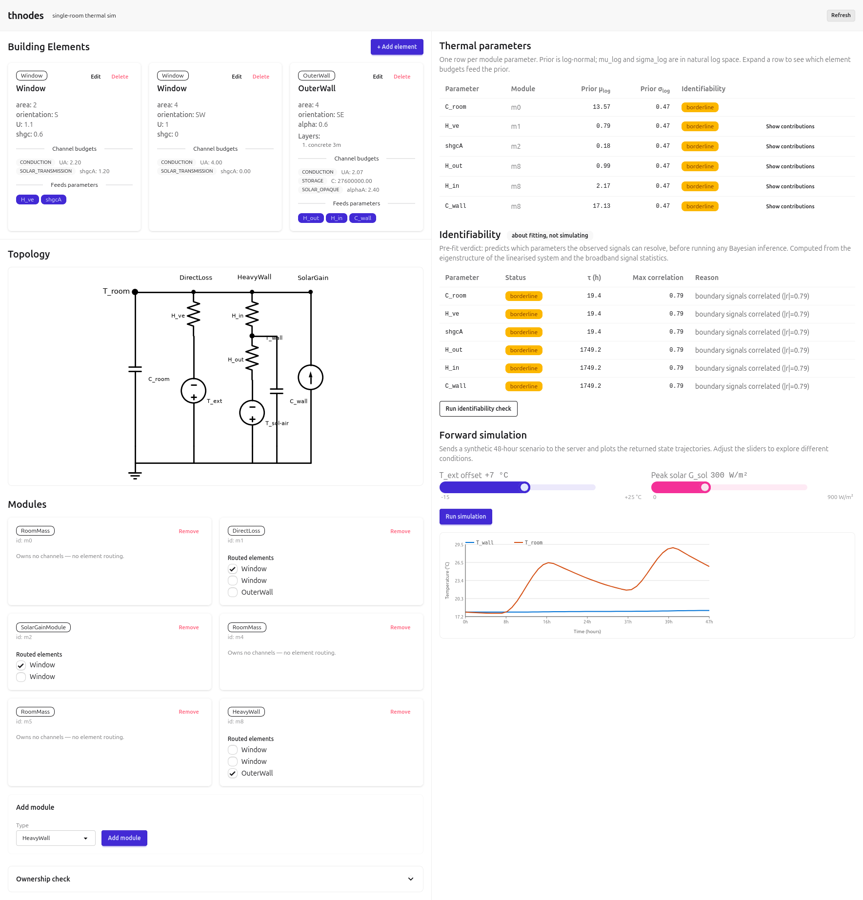

# thnodes `v0.3` *(third prototype)*

Single-room dynamic thermal building simulation + parameter identification.

A user describes a room physically (walls, windows, floor, HVAC…); the app assembles a minimal RC model and either **simulates** indoor temperature forward from weather inputs, or **fits** thermal parameters from sensor data by Bayesian inference.

## Stack

- **Backend** — FastAPI, pure-Python/NumPy numerics (`src/`)
- **Frontend** — Svelte + DaisyUI (`frontend/`)
- **Runtime** — `uv`-managed Python

## Docs

| Doc | Contents |
|-----|----------|
| [docs/specs/00_overview.md](docs/specs/00_overview.md) | Start here — spec map and reading order |
| [docs/specs/30_api.md](docs/specs/30_api.md) | FastAPI ↔ Svelte contract |
| [docs/specs/40_physics.md](docs/specs/40_physics.md) | Engine invariants (star topology, channels, forms) |
| [docs/background/app_proposal.md](docs/background/app_proposal.md) | Full design rationale and physics derivation |
| [docs/roadmap.md](docs/roadmap.md) | Implementation sequencing |
| [docs/TODO.md](docs/TODO.md) | Current task list |

## Status

Steps 0–1 (engine + topology rendering) and the Step-4a authoring UI are built. The fit layer (Steps 2–3, Kalman + NUTS) is not yet implemented.
