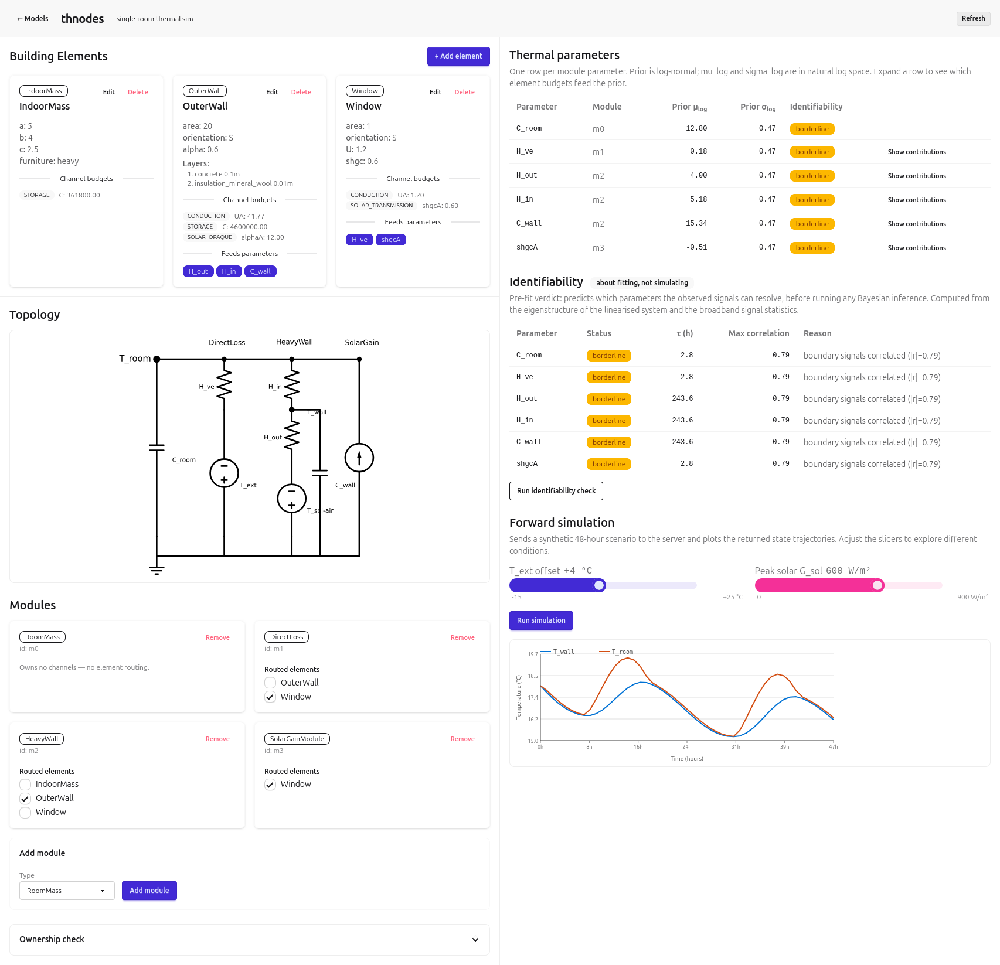

# thnodes `v0.3` _(third prototype)_

Single-room dynamic thermal building simulation + parameter identification.

A user describes a room physically (walls, windows, floor, HVAC…); the app assembles a minimal RC model and either **simulates** indoor temperature forward from weather inputs, or **fits** thermal parameters from sensor data by Bayesian inference.

## Stack

- **Backend** — FastAPI, pure-Python/NumPy numerics (`src/`)
- **Frontend** — Svelte + DaisyUI (`frontend/`)
- **Runtime** — `uv`-managed Python

## Docs

| Doc                                                                | Contents                                           |
| ------------------------------------------------------------------ | -------------------------------------------------- |
| [docs/specs/00_overview.md](docs/specs/00_overview.md)             | Start here — spec map and reading order            |
| [docs/specs/30_api.md](docs/specs/30_api.md)                       | FastAPI ↔ Svelte contract                          |
| [docs/specs/40_physics.md](docs/specs/40_physics.md)               | Engine invariants (star topology, channels, forms) |
| [docs/background/app_proposal.md](docs/background/app_proposal.md) | Full design rationale and physics derivation       |
| [docs/roadmap.md](docs/roadmap.md)                                 | Implementation sequencing                          |
| [docs/TODO.md](docs/TODO.md)                                       | Current task list                                  |

## Status

Steps 0–1 (engine + topology rendering) and the Step-4a authoring UI are built. The fit layer (Steps 2–3, Kalman + NUTS) is not yet implemented.

## Design history

This is the third prototype. The approach evolved through three main ideas before settling on the current architecture.

**v01 — Three-layer abstraction.**
The design had three distinct levels: (A) physical description (building elements), (B) a minimal RC model as the parameter-identification entry point, and (C) an atomic model seen by the solver. Going from A to C was straightforward, but constructing B — grouping atomic elements into a reduced model — turned out to be mathematically ill-posed: the reduction has no unique solution.

**v02 — Fixed topology.**
To sidestep the reduction problem, layer B was fixed to a single hardcoded topology (R2C2). The mapping from physical description to model became deterministic. The remaining challenge was handling rooms with different thermal behaviors; the answer could have been to zero-out unused parameters — a "modular" workaround which leads to v0.3

**v03 (current) — À-la-carte topology.**
Rather than a single fixed topology, the user selects which thermal modules to include (mass, glazing, ventilation, …). The topology is still minimal and purpose-built for parameter identification, but it is assembled from composable pieces inspired by the RC-network literature. This keeps the model parsimonious while accommodating real building diversity.

An alternative "brute-force" direction could have also considered, from v01: assemble the full RC network from all elements, then reduce or identify parameters mathematically (static factorisation, per-frequency-band factorisation, per-source factorisation, MCMC). This remains a valid research path but is not the current approach.
