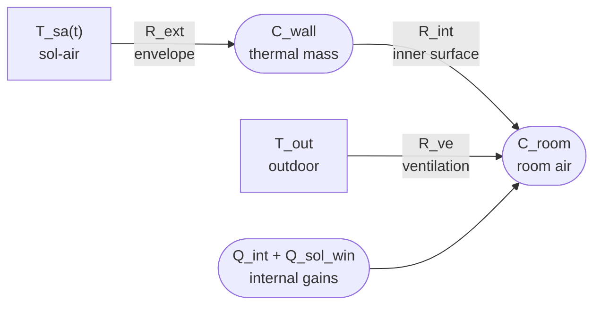

# Thermal nodes

A small engineering app for identifying the thermal parameters of a room from sensor data, using a 2R2C RC model and Bayesian inference.

## What it does

The user describes a room **element by element** — walls, windows, roof, floor — specifying geometry, orientation, and material layers. The app builds Gaussian priors on the five RC model parameters from the room description (ISO 6946 physics), then updates those priors to a posterior by fitting an observed indoor temperature log against weather data.

## Workflow

1. **Describe** the room: envelope elements, ACH, location.
2. **Inspect** the prior: H_env, H_ve, C_wall, C_room, α_eff with per-element breakdown and uncertainty.
3. **Upload** an observed indoor temperature log (hourly CSV). _(Phase 2)_
4. **Fit**: Bayesian update yields a posterior. _(Phase 2)_

## RC model

The room is a 2R2C network driven by sol-air temperature:



Five parameters with Gaussian priors:

| Symbol | Meaning                      | Unit |
|--------|------------------------------|------|
| H_env  | Envelope conduction loss     | W/K  |
| H_ve   | Ventilation heat loss        | W/K  |
| C_wall | Envelope thermal mass        | MJ/K |
| C_room | Interior thermal mass        | MJ/K |
| α_eff  | Effective outer absorptivity | —    |

## Physics references

| Module | Reference |
|---|---|
| Prior on H_env from layer stack | EN ISO 6946:2017 |
| Surface resistances (Rsi, Rso) | EN ISO 6946:2017 Table 1 |
| Material properties (λ, ρ, cp) | EN ISO 10456 / EN 1745 |
| Solar irradiance on tilted surface | Isotropic sky diffuse model (Hottel-Woertz) |
| Sol-air temperature | Spencer (1971) declination |
| Weather data | Open-Meteo historical archive (ERA5-based) |
| Likelihood for fit | Kalman filter on 2R2C state-space |

## Project structure

```
thermal/
  materials_db.py       # 30+ materials with λ, ρ, cp
  api_models.py         # Pydantic v2 models (Room, EnvelopeElement, MaterialLayer, *Out)
  priors.py             # build_priors(room) → Gaussian priors on RC parameters
  iso6946.py            # U-value, surface resistances
  solar.py              # Solar geometry and surface irradiance
  data_src/influx.py    # InfluxDB wrapper: list_signals(), fetch_series()
api.py                  # FastAPI app; serves frontend/dist/ as static files
frontend/        # Svelte + Vite source (builds into frontend/dist/)
  src/
    App.svelte          # Top-level layout + compute loop
    lib/store.js        # All state as Svelte stores + localStorage
    lib/*.svelte        # RoomFields, ElementCard, DataSources, SignalPicker,
                        # PriorBlock, DataPreview
tests/
  test_api.py           # pytest + httpx round-trip tests
```

## Running

Requires [uv](https://github.com/astral-sh/uv) and Node.js.

```bash
# Backend
uv run uvicorn api:app --reload   # → http://localhost:8000

# Frontend (dev mode with HMR, proxies /api/* to FastAPI)
cd frontend
npm install
npm run dev                        # → http://localhost:5173

# Or build for production (output served by FastAPI at :8000)
npm run build
```

## API

| Method | Path | Description |
|--------|------|-------------|
| GET | `/api/schema` | Element types and orientations (enum values for dropdowns) |
| GET | `/api/materials` | All materials with λ, ρ, cp, is_heavy |
| GET | `/api/signals` | Available InfluxDB signal names (empty if unreachable) |
| GET | `/api/data` | Fetch time-series for selected signals |
| POST | `/api/room/rc_model` | `Room` → `RCModelOut` (five parameter priors) |

Interactive docs at `http://localhost:8000/docs`.

## Scope and limitations

- Single-zone model: one thermal node per room
- Opaque elements use ISO 6946 series resistance (no thermal bridging correction)
- Ground-contact floor uses simplified boundary condition (no ISO 13370 ground coupling)
- Solar model uses isotropic diffuse sky; no shading or horizon masking
- Fit assumes hourly resolution and complete weather coverage for the log period
