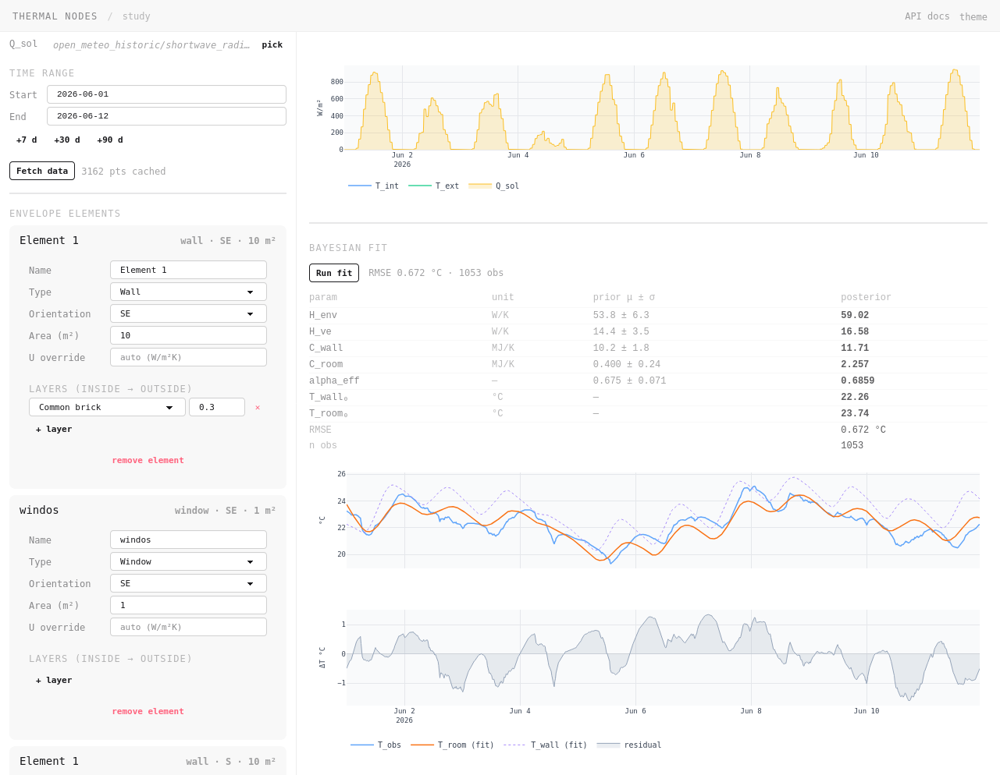
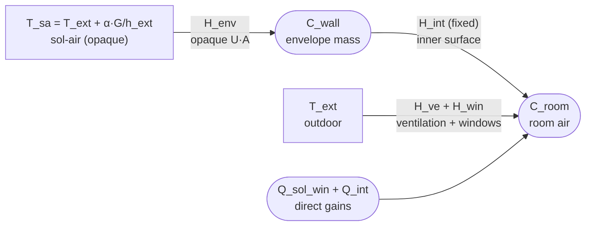

# Thermal nodes

A small engineering app for identifying the thermal parameters of a room from sensor data, using a 2R2C RC model and Bayesian inference.



## What it does

The user describes a room **element by element** — walls, windows, roof, floor — specifying geometry, orientation, and material layers. The app builds Gaussian priors on the five RC model parameters from the room description (ISO 6946 physics), then updates those priors to a posterior by fitting an observed indoor temperature log against weather data.

## Workflow

1. **Describe** the room: envelope elements, ACH, location.
2. **Inspect** the prior: H_env, H_ve, C_wall, C_room, α_eff with per-element breakdown and uncertainty.
3. **Select signals** (T_int, T_ext, Q_sol from InfluxDB) and a date range; click **Fetch data** to pull and cache the time-series inside the study file.
4. **Fit** _(Phase 2)_: Bayesian MAP update reads the cached data and yields a posterior.

Input data is stored in the study JSON (`input_data` field) — both the preview chart and the fit use the same frozen snapshot, so results are reproducible without a live InfluxDB connection at fit time.

## RC model

The room is a 2R2C network. Opaque walls are driven by sol-air temperature (absorbs direct solar on outer surfaces); windows pass solar directly into the room air.



Five free parameters with Gaussian priors:

| Symbol | Meaning                                  | Unit |
|--------|------------------------------------------|------|
| H_env  | Opaque envelope conduction loss (U·A)    | W/K  |
| H_ve   | Ventilation + window heat loss           | W/K  |
| C_wall | Envelope thermal mass (heavy layers)     | MJ/K |
| C_room | Interior thermal mass (furniture, air)   | MJ/K |
| α_eff  | Effective outer surface absorptivity     | —    |

`H_int` (inner-surface + layer conductance) is fixed from ISO 6946 geometry and is not fitted.

## Physics references

| Module | Reference |
|---|---|
| Prior on H_env from layer stack | EN ISO 6946:2017 |
| Surface resistances (Rsi, Rso) | EN ISO 6946:2017 Table 1 |
| Material properties (λ, ρ, cp) | EN ISO 10456 / EN 1745 |
| Solar irradiance on tilted surface | Isotropic sky diffuse model (Hottel-Woertz) |
| Sol-air temperature | Spencer (1971) declination |
| Weather data | Open-Meteo historical archive (ERA5-based) |
| Fit | MAP via scipy L-BFGS-B; Gaussian priors from ISO 6946; ZOH-discretised 2R2C likelihood |

## Project structure

```
thermal/
  materials_db.py       # 30+ materials with λ, ρ, cp
  api_models.py         # Pydantic v2 models (Room, EnvelopeElement, *Out, RCModelOut)
  priors.py             # build_priors(room) → Gaussian priors on 5 RC parameters
  iso6946.py            # U-value, surface resistances (ISO 6946)
  solar.py              # Solar geometry and surface irradiance
  state_space.py        # 2R2C A/B matrices, ZOH discretisation, forward_sim
  fit.py                # MAP fit via scipy L-BFGS-B; returns FitResult
  study.py              # Study Pydantic model (room, data_spec, input_data, rc_prior, fit_result)
  study_store.py        # CRUD over user_data/{id}.json
  data_src/influx.py    # InfluxDB wrapper: list_signals(), fetch_series()
api.py                  # FastAPI app; studies endpoints; serves frontend/dist/
frontend/               # Svelte + Vite source (builds into frontend/dist/)
  src/
    App.svelte          # Top-level layout, routing
    lib/StudyEditor.svelte  # Study editor (room + data + prior + fit)
    lib/DataSources.svelte  # Signal picker + date range + Fetch data button
    lib/DataPreview.svelte  # Plotly chart from cached input_data
    lib/PriorBlock.svelte   # Per-parameter prior (+ posterior overlay, phase 2)
    lib/*.svelte        # RoomFields, ElementCard, SignalPicker, StudiesList
tests/
  test_api.py           # pytest + httpx round-trip tests
```

## Running

Requires [uv](https://github.com/astral-sh/uv) and Node.js.

```bash
# Backend
uv run uvicorn api:app --reload   # → http://localhost:8000

# Frontend (dev mode with HMR, proxies /api/* to FastAPI)
cd frontend
npm install
npm run dev                        # → http://localhost:5173

# Or build for production (output served by FastAPI at :8000)
npm run build
```

## API

| Method | Path | Description |
|--------|------|-------------|
| GET | `/api/schema` | Element types and orientations (enum values for dropdowns) |
| GET | `/api/materials` | All materials with λ, ρ, cp, is_heavy |
| GET | `/api/signals` | Available InfluxDB signal names (empty if unreachable) |
| GET | `/api/studies` | List all studies (id, name, updated_at) |
| POST | `/api/studies` | Create a new study |
| GET | `/api/studies/{id}` | Full study JSON (room, data_spec, input_data, rc_prior, fit_result) |
| DELETE | `/api/studies/{id}` | Delete a study |
| POST | `/api/studies/{id}/duplicate` | Duplicate a study |
| PATCH | `/api/studies/{id}/name` | Rename a study |
| PATCH | `/api/studies/{id}/room` | Update room description → recomputes rc_prior |
| PATCH | `/api/studies/{id}/data_spec` | Update signal selection and date range |
| POST | `/api/studies/{id}/fetch_data` | Pull signals from InfluxDB, cache as input_data in study |
| POST | `/api/studies/{id}/fit` | Run MAP fit on cached input_data → stores fit_result _(Phase 2)_ |
| GET | `/api/studies/{id}/fit` | Return cached fit_result _(Phase 2)_ |

Interactive docs at `http://localhost:8000/docs`.

## Side projects

- [Inertie nocturne](inertie_nocturne/inertie_nocturne_mvp.html) — standalone HTML tool for estimating overnight room cool-down from thermal inertia.

## Scope and limitations

- Single-zone model: one thermal node per room
- Opaque elements use ISO 6946 series resistance (no thermal bridging correction)
- Ground-contact floor uses simplified boundary condition (no ISO 13370 ground coupling)
- Solar model uses isotropic diffuse sky; no shading or horizon masking
- Fit assumes hourly resolution and complete weather coverage for the log period
