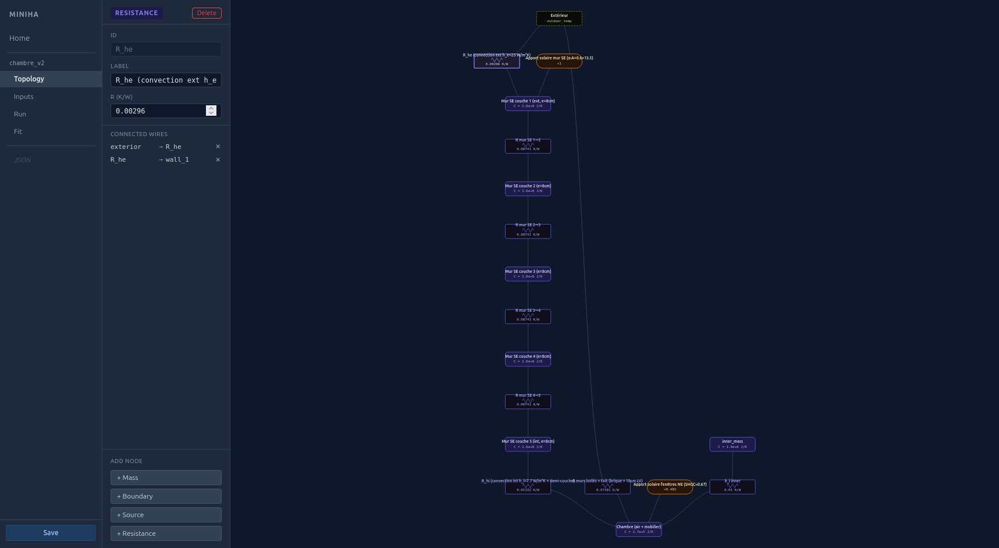
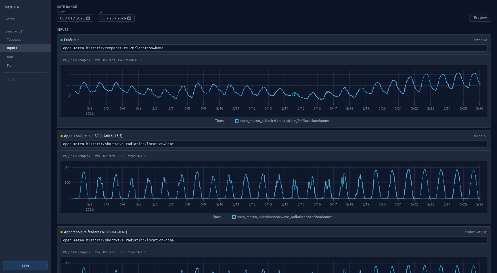
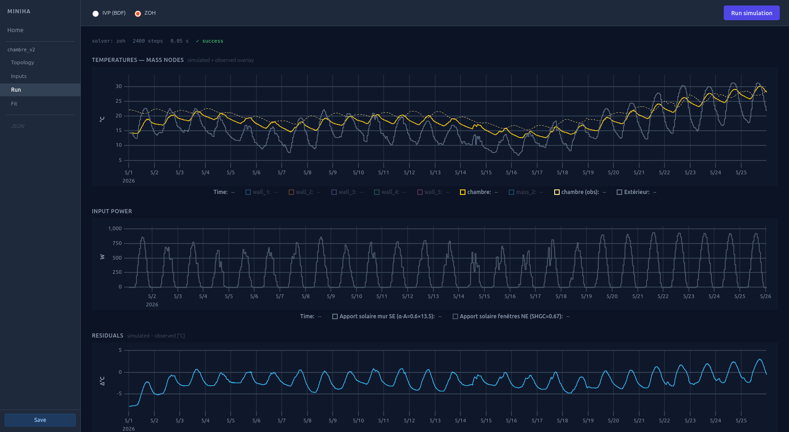
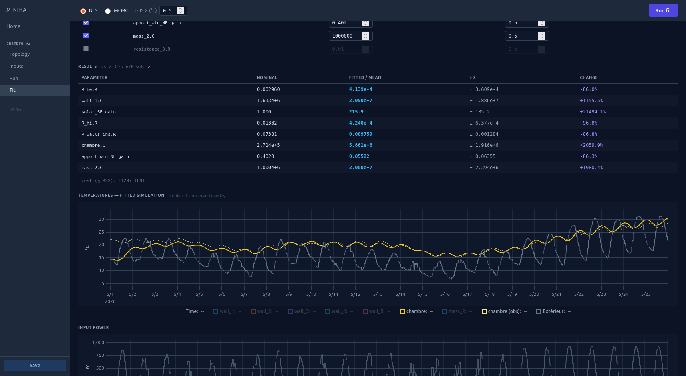

# thermogram

Model a house room-by-room as a thermal RC network, simulate it against sensor
data from InfluxDB, and fit model parameters to identify the thermal properties
of an existing building.

```
[house description]  →  expand()   →  RC graph  →  assemble()  →  ODE
 rooms, walls, λ        physics layer   R, C, edges   A, B matrices
```

The miniha parent project handles **data capture and logging** (InfluxDB).
thermogram consumes that data for **model identification**.

## Screenshots

<p align="center">
  
  
  
  
</p>

## Stack

| Layer                | Choice                                           |
| -------------------- | ------------------------------------------------ |
| Model + study format | JSON (`data/houses/<name>.json`)                 |
| Physics / solver     | Python — `scipy` (IVP/BDF + ZOH matrix exp.)     |
| Parameter estimation | NLS (`scipy.optimize`) or MCMC (`emcee`)         |
| Data source          | InfluxDB (via `GET /signals`, `GET /series`)     |
| API                  | FastAPI (port 8001)                              |
| UI                   | SvelteKit + `@xyflow/svelte` + uPlot             |

## UI

Split view: house pane on the left, study pane (tabs: RC Graph / Studies /
Simulation) on the right.

- **House pane** — room-by-room description, inline element editors.
- **RC Graph tab** — live preview of `expand(house)`, read-only.
- **Studies tab** — table of embedded studies; `+ Run` and `+ Fit` buttons.
- **Simulation tab** — date range, solver choice, run/fit button, temperature
  and residual charts. Stale banner when the house changed since the last run.

## Running

```bash
# First time
uv sync
cd ui && npm install && npm run build && cd ..

# Start — API + UI served at http://localhost:8001
uv run uvicorn thermogram.api.main:app --reload --port 8001
```

Rebuild the UI after frontend changes: `cd ui && npm run build`.

For frontend development with hot reload, run both in parallel:
```bash
uv run uvicorn thermogram.api.main:app --reload --port 8001
cd ui && npm run dev   # http://localhost:5173
```

InfluxDB connection is configured via environment variables (see
`api/config.py`): `MINIHA_INFLUX_HOST`, `MINIHA_INFLUX_PORT`,
`MINIHA_INFLUX_DB`.

## Project structure

```
thermogram/
  data/
    houses/          one .json per house (elements + embedded studies)
    materials/       material library (brick, concrete, rock wool, …)
  thermogram/        python package
    solver/
      physics.py     expand(house) → (rc_model, expansion_map)
      assemble.py    rc_model → AssembledSystem (A, B matrices)
      simulate.py    simulate_ivp + simulate_zoh
      fit.py         build_forward + fit_nls + fit_mcmc
      identifiability.py   group_params — correlated parameter analysis
      tests/
    api/
      main.py        FastAPI app
      influx.py      InfluxDB fetch + resample
      config.py      env config
  ui/
    src/
```

## Docs

- **[project_description.md](docs/project_description.md)** — architecture,
  data model, API surface, design decisions
- **[roadmap.md](docs/roadmap.md)** — open work
- **[todo.md](docs/todo.md)** — changelog and short-term tasks
