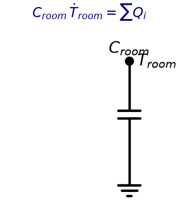
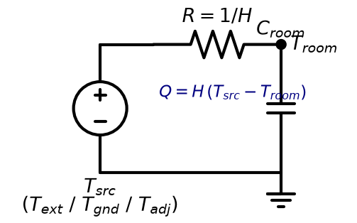
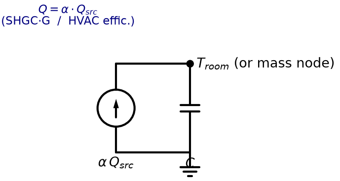
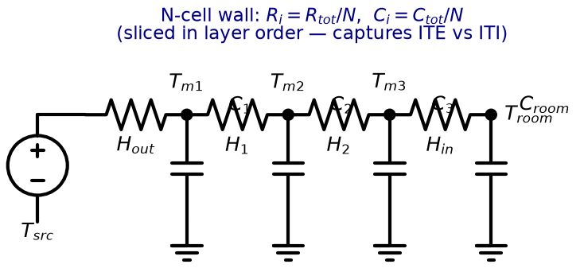
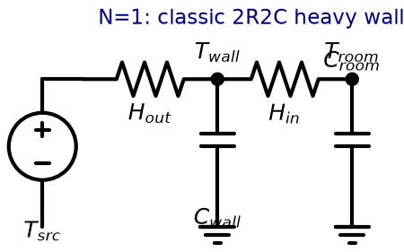
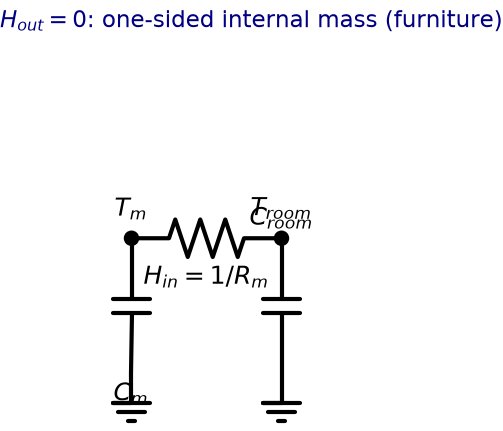

# Modular RC — physics model

**The single source of truth** for the modular RC engine's physics: the elements, the channels
they expose, and the module forms that consume those channels into an ODE system. `test_cases.md`
exercises this model on concrete buildings; `modular_rc_proposal.md` gives the design rationale
("why"); `todo_modular_rc.md` is the build roadmap.

Contents: **1.** elements · **2.** channels · **3.** module forms · **4.** assembly ·
**5.** RC↔thermal analogy & schematics.

---

## 1. Elements — generic description

An element is described independently of any module choice:

| field | meaning |
|---|---|
| `kind` | wall / window / roof / floor / door |
| `boundary` | `exterior` / `ground` / `adjacent` / `interior-of-zone` → sets the CONDUCTION source |
| `area`, `orientation`, `tilt` | geometry |
| `layers` (inside→outside) | → `U·A`, `C_heavy`, and the `RChain` `(k, ρcp, thickness)` prior |
| `shgc` | glazing → `SHGC·A` |
| `α` | exterior opaque → sol-air absorptance; or interior surface lit through glazing |

`boundary` replaces the old `is_ground_contact` boolean and makes "adjacent zone" first-class. What
channels an element offers follows mechanically from `(kind, boundary, layers, shgc, α)`.

---

## 2. Channels — `(mechanism, source)`

A channel is a **conserved budget** an element offers, computed once from geometry + ISO 6946 +
layers, model-agnostic. The unit of ownership is the `(element, channel)` pair. The key is a
**`(mechanism, source)` tuple** — the *source* (reference temp / driving signal) is part of the
identity, since conduction to outside, ground, and an adjacent zone are physically distinct paths.

| mechanism | source | budget | offered by |
|---|---|---|---|
| `CONDUCTION` | `T_ext` | `U·A` | exterior walls, windows, roof |
| `CONDUCTION` | `T_ground` | `U·A` | ground-contact floors, buried walls |
| `CONDUCTION` | `T_adj` | `U·A` | partitions, ceilings/floors to other zones |
| `CONDUCTION` | `T_ext` (air exchange) | `0.34·ACH·V` | the room (ventilation) |
| `SOLAR` | `G_sol` transmitted | `SHGC·A` | glazing → a target node |
| `SOLAR` | `G_sol` sol-air | `α·A` | opaque exterior surfaces |
| `SOLAR` | `G_sol` interior-absorbed | `α·A` behind glazing | interior mass lit through glazing *(Hole #1)* |
| `STORAGE` | — | `C_heavy` (ρ>500 layers) | walls/roof/floor with heavy layers |
| `SOURCE` | prescribed `Q(t)` | — | internal gains, HVAC (raw signal, no budget) |

Source-in-key dissolves near-duplicate modules: one `Conductance` form parameterized by source
covers `T_ext`/`T_ground`/`T_adj`. `STORAGE` is capacity, not flux — always claimed *together with*
a `CONDUCTION` channel by the module that gives the mass its node(s).

**Ownership rule:** per `(element, channel)` exactly one module; across channels an element may be
claimed by several. The assembler asserts exactly-once → **double-counting is a hard error**, not a
silent fit bug.

---

## 3. Module forms

Every flux in `C·dT/dt = ΣQ` is a module: it declares **params**, required **signals** (channel
sources), any **extra states** (temperature nodes with their own ODE), and how to **derive its
prior** by spending the budgets it claims.

There are **four flux forms**. Named modules are configurations of these (the source fixes the
name).

| form | flux into `T_room` | extra state | params | channels owned |
|---|---|---|---|---|
| `RoomMass` (base node) | `C_room·dṪ_room = ΣQ` | **`T_room`** | `C_room` | none — it *is* the balance |
| `Conductance` | `H·(T_src − T_room)` | — | `H` | `CONDUCTION@{T_ext\|T_ground\|T_adj}` |
| `SolarGain` | `α·Q_src` into a target node | — | `α` (SHGC, or HVAC effic.) | a `SOLAR` or `SOURCE` channel |
| `RChain` (`DelayedConductance`) | `H_in·(T_mN − T_room)` | `T_m1…T_mN` | derived from layers + `N` | `CONDUCTION@src` **+** `STORAGE` (+ a `SOLAR` for sol-air on outer node) |

Named configs: `DirectLoss`=`Conductance@T_ext` (merges window conduction + ACH);
`GroundLoss`=`@T_ground`; `AdjacentLoss`=`@T_adj`; `HeavyWall`=`RChain@T_ext`;
`HeavySlab`=`RChain@T_ground`; `HeavyPartition`=`RChain@T_adj` (free — no new code).

### 3.1 `RoomMass` — the base node



The room air balance is itself a module: it owns the `T_room` state and `C_room`; every other
module writes its flux into this node. Not special-cased — same shape as any node-owning module.

### 3.2 `Conductance` — `H·(T_src − T_room)`



A resistor `R = 1/H` from a reference temperature to the room. `DirectLoss` / `GroundLoss` /
`AdjacentLoss` are this one form with `T_src` = `T_ext` / `T_ground` / `T_adj`. `DirectLoss` merges
window conduction and ventilation (both `H·(T_ext − T_room)` on the same channel).

### 3.3 `SolarGain` — `α·Q_src`



A prescribed flux (current source) injected into a target node. Shared by **solar-through-glazing**
(α = SHGC, source `G_sol` per orientation) and **HVAC/heating** (α = efficiency/COP, source
`Q_hvac`) — same math, different prior. The target is usually `T_room`, but for direct-gain onto an
interior mass it is a chain node (Hole #1).

### 3.4 `RChain` (`DelayedConductance`) — the parametrizable N-node wall mass



One module spans the whole mass-node family by varying `N` and its two boundary conductances. It is
the 1-D heat equation discretized into `N` cells between an outer source and the room:

```
outer src ──H_out──[C_1]──H_1──[C_2]──H_2── … ──[C_N]──H_in── T_room
                     │                            │
              (optional sol-air solar)      (back-reaction into RoomMass)
```

Node ODE (interior node *i*):
```
C_i · dṪ_i = H_{i-1}·(T_{i-1} − T_i) − H_i·(T_i − T_{i+1})
```
The outer node sees `H_out·(T_src − T_1)` (+ optional sol-air `α·A·G`); the inner node *N* feeds the
room `H_in·(T_N − T_room)`, **and the room balance receives the equal-and-opposite
`+H_in·(T_N − T_room)`** — a mass node is never write-only, it pushes back on `RoomMass`.

**Params: derived from the layer stack; `N` is discretization only.** The chain has *one* physical
prior — `k_eq`, `(ρcp)_eq`, thickness from the ordered layer stack — sliced into `N` cells
(`R_i = R_total/N`, `C_i = C_total/N`). The fit sees a small fixed param set regardless of `N`;
raising `N` buys spatial fidelity (a 40 cm brick wall → `N`=5–10) without adding free parameters.
Identifiable.

**Special cases of the same module:**

| config | meaning | diagram |
|---|---|---|
| `N=1`, `H_out, H_in` finite | classic 2R2C heavy wall |  |
| `N=1`, `H_out=0` (adiabatic outer) | furniture / internal medium mass (one-sided) |  |
| `N`=5–10 | spatially-resolved thick wall (captures ITE vs ITI) | (the main `RChain` diagram) |

---

## 4. Assembly

1. For each element, compute its **channels** (conserved budgets) once.
2. Route each `(element, channel)` cell to its owning module; **assert exactly-once** on each cell.
3. Collect all `extra_states` → state-vector dimension.
4. Sum all `flux_room` contributions → RHS for `dT_room/dt`.
5. Append each extra state's `state_ode` → full ODE system.
6. Collect all `params` → parameter vector; collect all `signals` → check availability, warn if
   missing.

The same assembled system feeds both the forward simulator (①②) and the fit engine (③).

**Granularity** is a per-use choice: aggregate heavy elements into one node (`N=1`, fit-friendly,
recovers current 2R2C) or keep them per-element (more faithful, more states, for the simulation
toy). The channel model supports both — it is just whether `RChain` sums claimed elements into one
node or emits one per element.

---

## 5. RC ↔ thermal analogy & schematics

| electrical | thermal | unit |
|---|---|---|
| voltage `V` | temperature `T` | K |
| current `I` | heat flux `Q` | W |
| resistor `R` | thermal resistance `R = 1/H` | K/W |
| capacitor `C` | thermal mass `C` | J/K |
| ground (datum) | 0 K reference | — |
| voltage source | prescribed temperature (`T_ext`, `T_ground`, `T_adj`) | — |
| current source | prescribed heat flux (solar, HVAC) | — |

**Schematics (decision):** topology diagrams are rendered **server-side** with
[schemdraw](https://schemdraw.readthedocs.io/) → **SVG** (not PNG), because the assembled module
graph lives server-side and SVG is crisp at any zoom, themeable via CSS (matches the DaisyUI theme
switcher), and inlinable for later live-temperature animation — all without a JS topology library.
The generic per-form glyphs above are produced by [`draw_modules.py`](draw_modules.py)
(`uv run --with schemdraw --with matplotlib docs/draw_modules.py`); the engine-driven, per-study
renderer is **Stage 4** (`thermal/draw.py`).

---

## Validation status (from the Stage 0 expressiveness pass)

Exercised against six buildings in `test_cases.md`:

- **Exactly-once invariant:** holds in all six cases.
- **`(mechanism, source)` key:** validated — ground/adjacent become first-class, the three loss
  modules collapse to one `Conductance`, and `HeavyPartition` fell out free.
- **`RChain` generalization:** validated — furniture (`N=1, H_out=0`), 2R2C wall (`N=1`), and a
  discretized thick wall (`N`=5–10) are one module; `N` is resolution, not free params. The ITE/ITI
  case **requires `N>1`** to express, which justifies the discretization.
- **`RoomMass` as a module:** validated.

### Open holes / decisions (none block; for Stage 2 design)

1. **Direct-gain onto interior mass (Trombe).** `SolarGain` must accept a *target node*: the
   `SOLAR(interior-absorbed)` channel is owned by the lit element's `RChain`, spending `α·A` into
   its outer node rather than `T_room`. *(Earthship)*
2. **Heavy/light routing key:** route on the element's actual `C_heavy` magnitude (+ override), not
   the material-ρ `is_heavy` flag — a 1 mm metal skin (ρ=7800) must stay light or it spawns a
   ~0-capacity node. *(Caravan)*
3. **Position of heavy layer vs insulation** governs coupling — lives in the `RChain` per-cell
   `R_i/C_i` derivation from the *ordered* layer stack, not a new channel. Headlined by the ITE/ITI
   case. Renovation extras — thermal bridges (a `U·A` correction, deferred) and humidity
   (orthogonal, out of scope) — are not modelled.

**Sensor model:** deferred to ③ the fit (Bacher's measurement equation `y = T_room + e`);
passthrough for ①② simulation.
